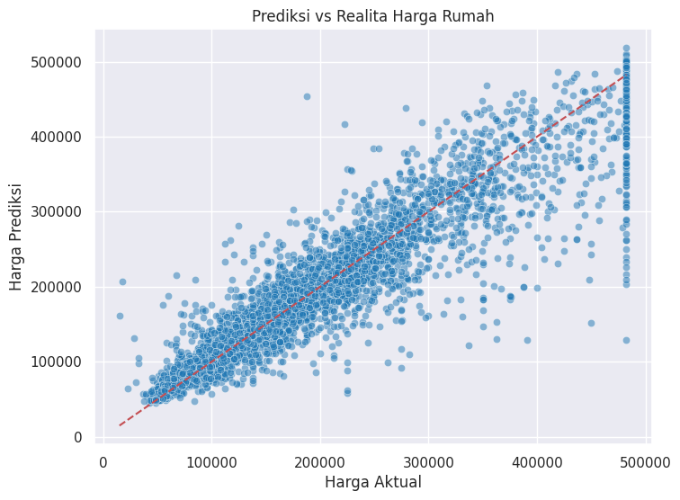

Berikut adalah versi laporanmu yang sudah ditambahkan gambar sesuai dengan struktur dan alur konten. Gambar dimasukkan menggunakan sintaks Markdown dan diletakkan agar nyambung dengan narasi.

---

# Laporan Proyek Machine Learning

**Nama:** Muhammad Zainudin Damar Jati

## Domain Proyek

Prediksi harga rumah merupakan komponen penting dalam pengambilan keputusan di bidang properti, investasi, dan perencanaan keuangan. Kompleksitas faktor-faktor seperti lokasi, demografi, dan karakteristik fisik properti menjadikan metode prediktif berbasis machine learning sebagai solusi yang menjanjikan untuk menghasilkan estimasi harga yang lebih akurat.

Proyek ini bertujuan membangun model prediktif menggunakan data perumahan di California, dengan memanfaatkan fitur demografis dan properti sebagai input.

**Referensi:**
Zhang, Y., Guhathakurta, S., & Khalil, E.B. (2019). A machine learning approach to real estate price prediction: A case study of Atlanta housing market. *Journal of Real Estate Research*.

## Business Understanding

### Problem Statements

1. Bagaimana membangun model prediksi harga rumah yang akurat dari data demografi dan properti?
2. Seberapa baik performa model dalam memprediksi harga rumah dibandingkan data sebenarnya?
3. Fitur-fitur mana yang paling berkontribusi terhadap harga rumah di California?

### Goals

1. Mengembangkan model machine learning untuk memprediksi harga rumah secara akurat.
2. Menilai performa model menggunakan metrik R², RMSE, MAE, dan validasi silang.
3. Mengidentifikasi fitur-fitur yang paling berpengaruh terhadap harga rumah menggunakan analisis feature importance dari model.

### Solution Statements

* Menggunakan algoritma HistGradientBoostingRegressor sebagai model utama.
* Melakukan preprocessing data: interpolasi nilai hilang, feature engineering, penanganan outlier.
* Menerapkan hyperparameter tuning untuk mendapatkan performa terbaik dari model.

## Data Understanding

Dataset digunakan dari [Kaggle - California Housing Prices](https://www.kaggle.com/datasets/camnugent/california-housing-prices). Dataset ini berisi data rumah-rumah di California berdasarkan sensus tahun 1990 dengan 20.640 entri dan 10 fitur utama.

### Fitur:

* `longitude`, `latitude` : Lokasi geografis
* `housing_median_age` : Usia median rumah
* `total_rooms`, `total_bedrooms` : Jumlah ruangan dan kamar tidur
* `population`, `households` : Jumlah penduduk dan rumah tangga
* `median_income` : Pendapatan median
* `ocean_proximity` : Kedekatan rumah terhadap laut (kategori)

### Target:

* `median_house_value` : Harga rumah median

### Feature Engineering:

* `rooms_per_household` : Rasio ruangan terhadap rumah tangga
* `bedrooms_per_room` : Rasio kamar tidur terhadap ruangan
* `population_per_household` : Rasio populasi terhadap rumah tangga

### Kondisi Missing Value:

* Fitur `total_bedrooms` memiliki 207 nilai hilang dari total 20.640 entri. Informasi ini penting dalam merancang strategi penanganan missing value pada tahap berikutnya.

### Visualisasi Awal:

* Distribusi fitur numerik sebelum preprocessing:

  

* Korelasi antar fitur numerik:

  

## Data Preparation

Tahapan data preparation dilakukan sebagai berikut:

* Interpolasi untuk mengisi nilai hilang pada `total_bedrooms`.
* SimpleImputer dengan strategi median digunakan pada fitur numerik lainnya melalui pipeline.
* Feature Engineering untuk menambahkan fitur rasio: `rooms_per_household`, `bedrooms_per_room`, `population_per_household`.
* Transformasi logaritmik (`np.log1p`) diterapkan pada target `median_house_value` untuk menstabilkan variansi.
* Penanganan Outlier dengan metode IQR untuk fitur numerik.
* One-Hot Encoding diterapkan pada fitur kategorik `ocean_proximity`.
* Scaling fitur numerik menggunakan MinMaxScaler (bukan StandardScaler seperti yang semula tertulis).
* Pembagian data dilakukan sebelum modeling: 80% data latih dan 20% data uji.

## Modeling

Model utama yang digunakan adalah HistGradientBoostingRegressor, yaitu algoritma ansambel berbasis boosting yang membangun decision tree secara bertahap. Model ini memanfaatkan histogram-based binning untuk efisiensi dan performa yang lebih baik, terutama pada dataset besar.

### Proses Modeling:

* Pemisahan data menjadi `X` (fitur) dan `y` (target)
* Preprocessing melalui Pipeline dan ColumnTransformer:

  * Numerik: Imputasi median, scaling
  * Kategorik: One-Hot Encoding
* Penerapan RandomizedSearchCV untuk tuning hyperparameter dengan parameter grid:

  * `max_iter`: \[100, 200, 300]
  * `max_leaf_nodes`: \[31, 50, 100]
  * `learning_rate`: \[0.05, 0.1, 0.2]

Nilai terbaik dari hasil tuning yang digunakan untuk model final:

* `max_iter = 300`
* `max_leaf_nodes = 100`
* `learning_rate = 0.05`

## Evaluation

### Hasil Evaluasi Model Final:

* R² Score: 0.8435 → Model menjelaskan 84.35% variansi target
* RMSE: \$44,481 → Deviasi prediksi dari nilai aktual rata-rata sebesar \$44.481
* MAE: \$28,332 → Rata-rata kesalahan absolut sebesar \$28.332

### Cross-Validation:

* R² Score rata-rata: 0.7014 ± 0.0602, menunjukkan stabilitas performa model terhadap data baru.

### Visualisasi Evaluasi:

* Prediksi vs Realita:

   
  
* Distribusi Residual:

  

* Feature Importance:

  (disarankan ditambahkan juga jika ada gambar visualisasi importance, misal: images/feature\_importance.png)

## Deployment: Prediksi Rumah Baru

### Input Rumah Baru:

* `longitude`: -118.0
* `latitude`: 34.0
* `housing_median_age`: 30
* `total_rooms`: 2000
* `total_bedrooms`: 400
* `population`: 800
* `households`: 300
* `median_income`: 5.0
* `ocean_proximity`: "NEAR OCEAN"

### Output Prediksi:

* Harga Rumah (prediksi): \$290,653.41

Model mampu memberikan estimasi harga rumah yang realistis berdasarkan fitur input, dan dapat digunakan dalam pengambilan keputusan sektor properti.

## Kesimpulan

Proyek ini berhasil membangun model prediksi harga rumah di California yang akurat menggunakan algoritma HistGradientBoostingRegressor. Model ini mampu menjelaskan lebih dari 84% variansi data dan menghasilkan error prediksi yang relatif kecil.

Seluruh proses mulai dari eksplorasi data, penanganan missing value, transformasi target, hingga tuning model dilakukan secara sistematis. Evaluasi model menunjukkan performa stabil melalui validasi silang.

Lebih lanjut, analisis feature importance menjawab problem statement ketiga dengan menunjukkan bahwa `median_income`, `ocean_proximity`, dan `latitude` merupakan fitur yang paling memengaruhi harga rumah.

Model ini siap di-deploy sebagai alat bantu pengambilan keputusan dalam sektor properti dan investasi.

**Dataset**: [Kaggle - California Housing Prices](https://www.kaggle.com/datasets/camnugent/california-housing-prices)

---

Jika kamu juga punya gambar feature importance atau residuals dengan plot tambahan, kamu bisa beri tahu saya agar saya bantu menambahkan secara kontekstual juga.
